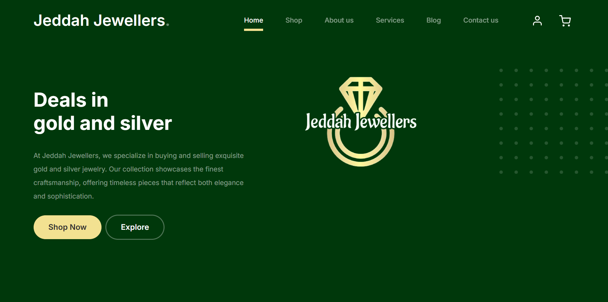
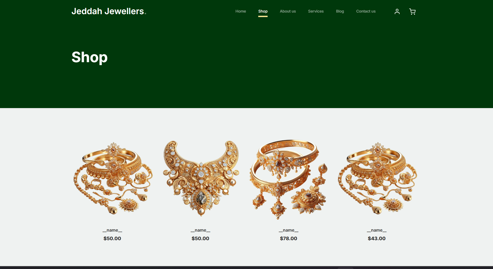

# 💎 Jeddah Jewellers – Luxury Jewelry Website

**Jeddah Jewellers** is a modern and elegant jewelry store website built using **HTML**, **CSS**, and **JavaScript**. The site is designed to showcase premium jewelry collections with smooth navigation, responsive design, and eye-catching visuals.

---

## 🌟 Features

- 🖼️ Hero section with welcoming headline and visuals
- 💍 Product display grid for rings, earrings, necklaces, and more
- 🎨 Stylish, responsive layout using CSS Flexbox and Grid
- 📱 Mobile-friendly design for all screen sizes
- 💫 Smooth scrolling and basic interactivity with JavaScript

---

## 🛠️ Tech Stack

- HTML5
- CSS3
- JavaScript (Vanilla)
- Responsive Web Design Principles

---

## 📸 Screenshots

### 🏠 Homepage



The homepage showcases premium jewelry with a clean, elegant design and responsive layout.


### 🛍️ Shop Page



The shop page features a well-structured product grid with smooth styling and mobile responsiveness.

---

## 🌐 Live Demo

> 🔗 https://fahad-ali-github.github.io/JeddahJewellers/shop.html

---

## ⚙️ How to Run Locally

```bash
# 1. Clone the repository
git clone https://github.com/FAHAD-ALI-github/JeddahJewellers.git
cd JeddahJewellers

# 2. Open index.html in your browser
```

---

## 📂 Folder Structure

```
JeddahJewellers/
├── index.html
├── css/
│   └── styles.css
├── js/
│   └── script.js
├── images/
└── screenshots/
```

---

## 📫 Contact

Fahad Ali  
[LinkedIn](https://www.linkedin.com/in/fahadali1078) • [GitHub](https://github.com/FAHAD-ALI-github)

---
